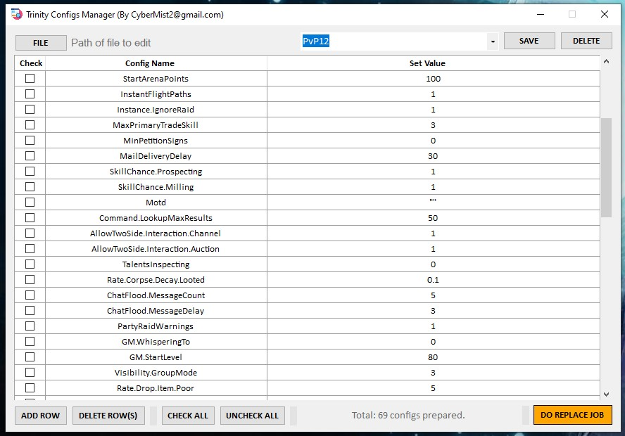

# LinesFindAndReplace
Windows app, finds and replaces multiple lines from a text compatible file

## 
| Current Status | Issues Open | Current Version | Latest Release | Guest Downloads |
| ------------- |:-------------:|:-------------:|:-------------:|:-------------:|
|  |  |  |  |  |

Author: CyberMist2@gmail.com

